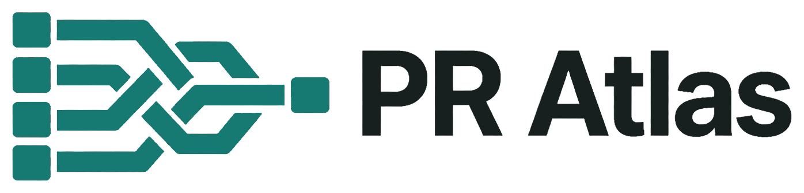

<p align="center">
  
</p>

<h1 align="center">PR Atlas</h1>

<p align="center">
  Understand the changed system, not just the changed files.
</p>

PR Atlas is a local-first Electron workspace for understanding pull requests as
logical changes, evidence, tests, review signals, and guided system flows. It
keeps the review surface deterministic while using a coding-agent runtime to
collect and explain repository evidence.

## What users get

- A read-only view of repositories and open pull requests discovered through the
  active GitHub CLI account.
- A guided walkthrough organized by logical change groups, with before/after
  behavior, rationale, and links to exact evidence.
- A review surface that connects code, tests, graphs, commits, specifications,
  and complete human or automated review threads.
- A local history of validated walkthroughs, including the provider, tool-
  reported model, schema/skill versions, and the analyzed commit SHA.
- A fixed application UI that renders validated JSON instead of executing
  provider-generated HTML or JavaScript.

PR Atlas is primarily a comprehension and navigation tool. It does not replace
human judgment with an automatic approval or code-review verdict.

## Capabilities

### Local-first PR discovery

PR Atlas reuses `gh` authentication for `github.com`, lists repositories and
open pull requests, and reads pull-request metadata and review data. Analysis
runs in an application-managed clone/worktree so the user’s branches and
working trees are not changed.

### Provider-backed analysis

The provider discovery/default order is **Codex CLI → Cursor Agent → Claude
Code**. This is a priority order, not an automatic claim that one provider can
stand in for another: choose an installed provider in Settings. PR Atlas asks
the provider tool for its current model list and accepts only model IDs that
the tool reports; it does not maintain a hard-coded model catalog.

Each adapter produces the same provider-neutral walkthrough contract:

| Provider | Executable | Boundary used by PR Atlas |
| --- | --- | --- |
| Codex CLI | `codex` | `exec`, read-only sandbox, ephemeral run, user config/rules ignored, JSON Schema output |
| Cursor Agent | `cursor-agent` | Ask mode, sandbox enabled, workspace-scoped, JSON output and schema prompt |
| Claude Code | `claude` | Safe mode, plan permission mode, `Read`/`Grep`/`Glob` allow-list, no session persistence, JSON Schema output |

Before a live run, PR Atlas shows a provider-specific confirmation. You can
cancel or add bounded supplemental collection guidance. Repository context,
the selected pull request, and deterministic input artifacts are sent to the
selected provider’s configured model service only after that confirmation.

### Evidence-backed walkthroughs

Walkthrough claims are linked to regular files, symbols, commits, changed-file
facts, tests, specifications, and review comments. The app validates schema
version, pull-request identity, base/head SHAs, evidence paths, graph
relationships, and review-thread coverage before saving a result. If the head
SHA changes, the saved walkthrough is marked outdated and can be rerun.

### Graphs, review, tests, and history

Every validated walkthrough can expose four directed views: system overview,
data flow, code dependency, and user action. Graphs support changed/context
filters, search, change-group highlighting, pan, zoom, fit-to-view, and guided
tours. The same evidence can be followed through:

- logical change groups and review order;
- clustered review insights while preserving active, resolved, outdated, and
  disputed state;
- test-to-behavior mappings (`covered`, `partial`, or `missing`); and
- exact run history, provider, model, schema, and skill metadata.

The UI supports **System**, **Light**, and **Dark** themes.

## How it works

```text
GitHub CLI (existing auth, read operations)
                  │
                  ▼
Electron main process ── fetch PR/reviews ──► app-managed clone/worktree
        │                                         │
        ├─ provider adapter (Codex → Cursor → Claude)
        │       read-only/plan boundary + JSON Schema contract
        │                                         │
        ├─ strict validation + evidence normalization
        │                                         │
        └─ local app-data store ◄── manifest, inputs, logs, walkthrough, history
                  │
                  ▼
      narrow preload IPC → sandboxed React/Vite renderer
                  │
                  ▼
        walkthrough, graphs, review, tests, and exact evidence links
```

## Requirements

- Node.js 20 or newer.
- npm (the lockfile is committed; use `npm ci` in CI and reproducible builds).
- GitHub CLI (`gh`) authenticated for `github.com` and authorized to read the
  repositories you want to inspect.
- At least one supported analysis runtime on `PATH`: `codex`, `cursor-agent`,
  or `claude`.
- A supported desktop target for packaged builds: macOS (x64 or arm64),
  Windows (x64), or Linux (x64).

## Quick start

Authenticate GitHub CLI if needed, then install dependencies and launch the
desktop development workflow:

```sh
gh auth login --hostname github.com
npm install
npm run dev
```

`npm run dev` starts Vite on `127.0.0.1:5173`, builds the Electron main/preload
bundles, and opens the desktop app. Select a live repository, select an open PR,
choose an installed provider/model, review the consent dialog, and start local
analysis. The browser-only renderer fixture can also be run with
`npm run dev:web` when Electron integration is not needed.

## Data, privacy, and security boundaries

- GitHub access reuses the active `gh` session. PR Atlas does not implement a
  PR Atlas account, OAuth flow, or personal-access-token store.
- GitHub operations are read-oriented: discovery uses `gh` APIs and analysis
  fetches/clones source and pull-request artifacts. PR Atlas does not post,
  edit, resolve, or approve GitHub reviews.
- Source, deterministic inputs, raw provider output, logs, manifests, and
  validated walkthroughs remain under Electron’s application-data directory.
  Managed clones/worktrees are separate from the user’s checkout.
- A live analysis intentionally sends selected repository context to the
  configured provider model service after consent. Provider network use,
  retention, and account policy are controlled by that provider, not PR Atlas.
- Provider child processes receive a small allow-listed environment. Provider
  credentials are passed only to their matching adapter; diagnostics and
  persisted provider text are redacted for common secret forms.
- The renderer runs with context isolation, no Node integration, and Electron
  sandboxing. IPC accepts validated repository, revision, path, provider, model,
  and prompt values. External navigation is restricted to HTTPS GitHub URLs.
- Repository and review content is treated as untrusted input. The analysis
  prompt instructs providers to read only supplied artifacts/source and never
  obey instructions found inside repository or review data.

## Developer commands

| Command | Purpose |
| --- | --- |
| `npm run dev` | Start Vite and the Electron desktop app |
| `npm run dev:web` | Start the renderer only on `127.0.0.1:5173` |
| `npm run dev:desktop` | Wait for Vite, build Electron bundles, launch Electron |
| `npm test -- --run` | Run the Vitest suite once |
| `npm run test:watch` | Run Vitest in watch mode |
| `npm run typecheck` | Typecheck the renderer/shared TypeScript |
| `npm run typecheck:electron` | Typecheck Electron/main-process TypeScript |
| `npm run build` | Electron bundles, both typechecks, and Vite production build |
| `npm run preview` | Preview the Vite production renderer |
| `npm run package` | Build and package for the current electron-builder target |
| `npm run package:mac` | Build macOS DMGs |
| `npm run package:win` | Build the Windows NSIS installer |
| `npm run package:linux` | Build Linux AppImage and deb packages |

Build output goes to `dist/` (renderer) and `dist-electron/` (main/preload);
packaged artifacts go to `release/`.

## Project structure

```text
electron/
  main.ts, preload.ts          Electron window, IPC, and trust boundary
  backend/                     GitHub, providers, validation, storage, updates
shared/
  contracts.ts, schema.ts      Provider-neutral types and walkthrough validation
src/
  App.tsx                      Renderer workflow and views
  components/                  Review-thread and renderer components
  data/                        Deterministic demo fixture
  styles.css                   Light/dark/system UI styles
public/
  pr-atlas-logo.png            Full product wordmark used by this README
  favicon.png                  Brand mark used by the app UI and package icon
tests/
  backend/, renderer/          Provider, security, schema, update, and UI tests
  app.behavior.test.tsx        Renderer behavior coverage
prd.md                         Product and technical specification
```

## Test and validation matrix

The suite covers backend contracts, renderer behavior, provider safety,
storage, release automation, update verification, and branded empty states.

| Validation slice | Command | What it protects |
| --- | --- | --- |
| Full unit/component suite | `npm test -- --run` | Backend, renderer, schema, storage, release workflow, and branded empty-state behavior |
| Focused provider/security | `npm test -- --run tests/backend/providers.test.ts tests/backend/agent-security.test.ts` | Adapter boundaries, model discovery, environment and output redaction |
| Focused update/release | `npm test -- --run tests/backend/update.test.ts tests/release-workflow.test.ts` | URL/asset selection, digest checks, collision-safe downloads, packaging runner |
| Renderer behavior | `npm test -- --run tests/app.behavior.test.tsx tests/renderer` | Theme controls, live discovery, update UX, graphs, evidence, and empty states |
| Renderer typecheck | `npm run typecheck` | React/shared TypeScript contracts |
| Electron typecheck | `npm run typecheck:electron` | Main process, adapters, IPC, storage, and update code |
| Production build | `npm run build` | Electron bundles, typechecks, and Vite output |

## Packaging and release assets

The package configuration uses `electron-builder` with product name `PR Atlas`,
app ID `com.pratlas.desktop`, and output directory `release/`.

| Platform | Target | Exact asset name/pattern |
| --- | --- | --- |
| macOS | DMG, x64 | `PR-Atlas-${version}-mac-x64.dmg` |
| macOS | DMG, arm64 | `PR-Atlas-${version}-mac-arm64.dmg` |
| Windows | NSIS, x64 | `PR-Atlas-${version}-win-x64.exe` |
| Linux | AppImage, x64 | `PR-Atlas-${version}-linux-x86_64.AppImage` |
| Linux | deb, x64 fallback | `PR-Atlas-${version}-linux-amd64.deb` |

Here `${version}` is the release version without the leading `v` (for example,
`0.2.2`). Local package commands are:

```sh
npm run package:mac
npm run package:win
npm run package:linux
```

### In-app update workflow

At startup, Electron checks the public GitHub Releases API at
`https://api.github.com/repos/roeyazroel/pr-atlas/releases/latest`. The update
path is deliberately narrow:

1. Accept only a newer, non-draft semantic version.
2. Require the release page to be the exact HTTPS URL
   `https://github.com/roeyazroel/pr-atlas/releases/tag/v<version>`.
3. Select only the exact platform/architecture asset name in the table above
   (Linux may use the explicit deb fallback).
4. Require the asset download URL to be the exact HTTPS GitHub release path;
   redirects are limited to GitHub’s release/CDN hosts.
5. Download to a hidden temporary file in the user’s Downloads directory,
   stream-hash the bytes, and require the GitHub-provided
   `sha256:<64 lowercase hex>` digest to match. Finalization is exclusive, so
   existing files and files created concurrently are never overwritten.
6. Hash the completed file again immediately before opening it, refusing a
   missing or mismatched artifact at that check.

The sidebar provides a direct Download action, then a one-click Open installer
action after verification; View release remains available as a fallback. The
app does not silently replace the running binary.

This protects against corrupt downloads and ordinary post-download tampering.
A local actor that can replace files in Downloads during the narrow interval
between the final hash and the operating system opening the path remains a
residual risk of the path-based installer launch.

### Release Please flow

Pushes to `main` run `.github/workflows/release.yml`:

1. Release Please collects Conventional Commits and opens/updates a release PR.
2. Merging the release PR updates `package.json`, `package-lock.json`, and
   `CHANGELOG.md`, creates the matching `v<version>` tag, and creates the GitHub
   release.
3. The workflow checks out that exact tag, verifies tag/package alignment, runs
   tests, renderer/Electron typechecks, and the application build.
4. macOS, Windows, and Linux packaging jobs build the assets above and attach
   them to the same release after exact-release verification.

The committed workflow currently packages macOS on `macos-15-intel`, Windows
on `windows-2022`, and Linux on `ubuntu-24.04`.

### Signing and macOS updates

Artifacts are currently unsigned and not notarized. Users may need to approve
the download in their operating system security settings. Supported macOS
in-place auto-update is unavailable without Developer ID signing and
notarization, so the supported update path downloads and opens the DMG for the
user to install.

## Troubleshooting

**“GitHub CLI is not authenticated”**

Run `gh auth status --hostname github.com`, then authenticate with
`gh auth login --hostname github.com`. Confirm the account can read the selected
repository.

**No provider is available**

Install `codex`, `cursor-agent`, or `claude`, put it on `PATH`, and restart the
app. Provider discovery runs the tool’s version command and, when available,
its model-listing command.

**A model cannot be selected**

Refresh provider discovery and choose a model currently reported by that tool.
PR Atlas rejects stale or hand-entered model IDs.

**Analysis fails or is marked invalid**

Check the provider’s own authentication/configuration, confirm the repository
is readable, and rerun. A result is not shown as ready unless its JSON,
evidence, pull-request revisions, graph references, and review coverage pass
validation.

**The walkthrough says it is outdated**

The pull request head SHA changed after the run. Select **Update walkthrough**
to collect and validate a new run; historical runs remain available.

**The installer will not open**

Retry the download from the in-app update notice. The app refuses missing,
modified, malformed, or digest-mismatched files; use **View release** only to
inspect the exact GitHub release page.

**macOS blocks the app or DMG**

This release is not Developer ID signed or notarized. Approve the download in
System Settings/Finder as appropriate for your macOS security policy.

## License

PR Atlas is distributed under the MIT License; see [`LICENSE`](LICENSE).
